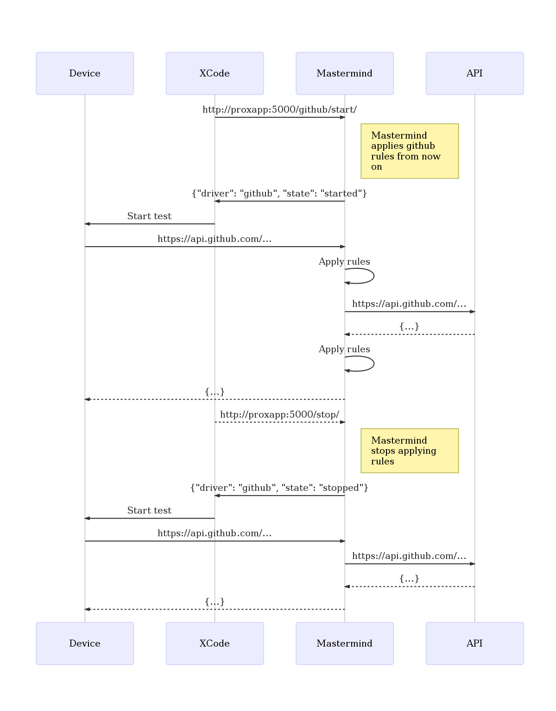

# Mastermind

Mastermind is written on top of the great [mitmproxy](https://mitmproxy.org)
to allow an easy way to intercept specific HTTP requests and mock its responses.

It has a complementary tool to easily switch the **OSX** proxy configuration.


## Install

```sh
pip install "git+https://github.com/ustwo/mastermind.git@v0.6.0#egg=mastermind"
```

## Mastermind

Mastermind is a CLI using `libmproxy` that offers an easy way to define rules
to intercept HTTP(S) requests and mock its responses.  By default it makes sure
the OSX proxy settings are enabled only when the proxy is running.

The proxy runs by default on `http://localhost:8080`.

There are three forms you can use, "Driver", "Simple" and "Script".  They can't
be mixed.

**Note** Examples using `sudo` indicate you need high privileges to let
mastermind change the *system* proxy configuration.  If you run it
`--without-proxy-settings` there is no need for special privileges.

### Driver

The driver mode will mount a thin HTTP server listening for actions at
`http://proxapp:5000` and a set of rules to apply.

```sh
sudo mastermind --with-driver \
                --source-dir $(pwd)/test/records
```

In the example above, `mastermind` will expect to find one or more YAML ruleset
files.  [Check the example](test/records).

A ruleset file is an array of rules.  Each rule is composed by at least a `url`
and a `response.body`.  The body must be a _relative_ path to an existing file.

```yaml
---
- url: https://api.github.com/users/octocat/orgs
  response:
    body: fake.json
```

A more elaborated case will have headers to add or remove:

```yaml
---
- name: bar
  url: https://api.github.com/users/arnau/orgs
  request:
    headers:
      remove:
        - 'If-None-Match'
  response:
    body: arnau-orgs.json
    headers:
      remove:
        - 'ETag'
      add:
        Cache-Control: no-cache
        X-ustwo-intercepted: 'Yes'
```

**Note**: Examples use `curl` which does not use the system proxy by default.
This is why the `--proxy` flag is used.  In contexts like Safari or XCode this
is implicit.

Assuming the two examples above were named `foo.yaml` and `bar.yaml` a running
`mastermind` in driver mode would load the first with:

```sh
$ curl --proxy http://localhost:8080 \
       -XGET http://proxapp:5000/foo/start/
{"driver": "foo", "state": "started"}
```

The second with:

```sh
$ curl --proxy http://localhost:8080 \
       -XGET http://proxapp:5000/bar/start/
{"driver": "bar", "state": "started"}
```

And cleaning any ruleset with:

```sh
$ curl --proxy http://localhost:8080 \
       -XGET http://proxapp:5000/stop/
{"driver": "bar", "state": "stopped"}
```

If you want to check what driver is being used, use `/state/`:

```sh
$ curl --proxy http://localhost:8080 \
       -XGET http://proxapp:5000/state/
{"driver": "bar", "state": "running"}
```

When no driver is running the response is `{"driver": null, "state": null}`.

**Note** URI without a trailing slash (`/`) will be redirected (301) to the
canonical ones with trailing slash.  If you use curl you might want to use the
`-L` flag.

In one picture:



#### Validation with JSON Schema

When a `schema` is present at the driver level the original resopnse will be
validated against the given JSON schema file.

The mocked response will be sent even if the validation fails.  This ensures
you get the information when the API contract is broken without making your
test cycle suffer.


```yaml
---
- name: baz
  url: https://api.github.com/users/arnau/orgs
  schema: github-orgs-schema.json
  response:
    body: arnau-orgs.json
```

The driver above will check that the _original_ response from Github is valid
according to `github-orgs-schema.json`.  You can access the exception list via
the `/<driver_name>/exceptions/` endpoint:

```sh
$ curl --proxy http://localhost:8080 \
       -XGET "http://proxapp:5000/fake/exceptions/?uri=https://api.github.com/users/arnau/orgs"
{"driver": "baz",
 "uri": "https://api.github.com/users/arnau/orgs",
 "exceptions": [...]}
```

If you don't specify a `uri` parameter it will return all URIs recorded:

```sh
$ curl --proxy http://localhost:8080 \
       -XGET "http://proxapp:5000/fake/exceptions/"
{"driver": "baz",
 "exceptions": [{"https://api.github.com/users/arnau/orgs": [...]}]}
```

An exception has the following shape:

```json
{
  "cause": null,
  "context": [],
  "message": "'descriptionn' is a required property",
  "path": [0],
  "schema_path": ["items", "required"],
  "timestamp": "2016-01-19T14:32:19.424100"
}
```

**Warning** The exception shape is not stable.


### Simple

The simple mode expects a response body filepath and a URL to intercept:

```sh
sudo mastermind --response-body $(pwd)/test/records/fake.json" \
                https://api.github.com/users/octocat/orgs
```

### Script

**Use this option if you *know* what you are doing**.

The script mode expects a mitmproxy Python script:

```sh
sudo mastermind --script $(pwd)/myscript.py
```

Or pass parameters to your script the same way mitmproxy does:

```sh
sudo mastermind --script "$(pwd)/myscript.py param1 param2"
```

If you go for the `--script` approach, you have to explicitly manage proxyswitch
yourself. Adding the following will do the trick:

```python
from proxyswitch import enable, disable

def start(context, argv):
    enable('127.0.0.1', '8080')

def done(context):
    disable()
```


Check the help for more.

```sh
mastermind --help
```


## Proxyswitch

CLI to switch on and off the OSX proxy configuration for HTTP and HTTPS. Check
the help:

```sh
proxyswitch --help
```


## Maintainers

* [Arnau Siches](mailto:arnau@ustwo.com)


## License

This is a proof of concept with no guarantee of active maintenance.

See [License](./LICENSE)
